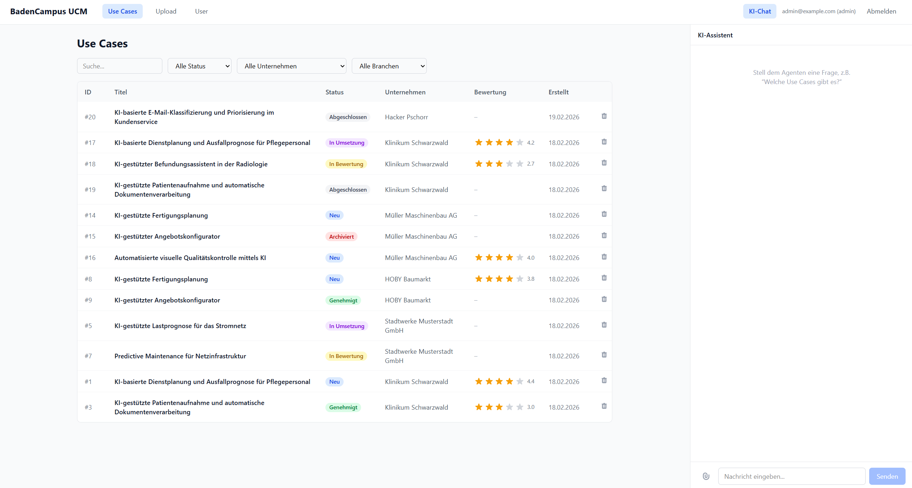
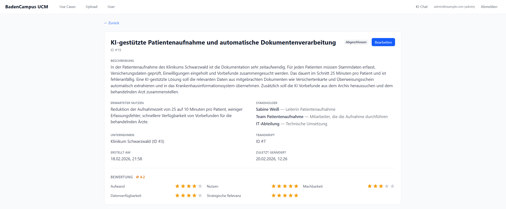
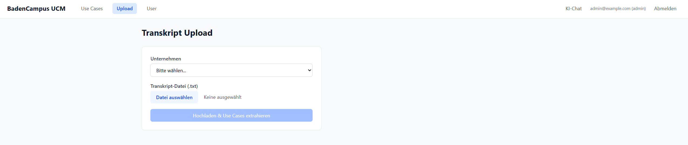
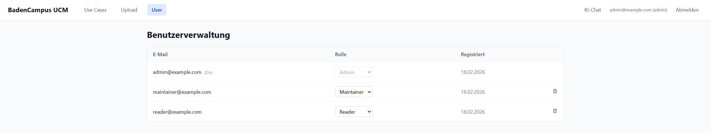

# AI Use Case Manager
> KI-gestützter Agent zur Extraktion und Verwaltung von Use Cases aus Workshop-Transkripten.

## Anwendung
### Use Case Liste + KI-Chat

Hauptansicht mit filterbarer Use-Case-Tabelle (Status, Unternehmen, Branche), Bewertungs-Sternen und einklappbarem KI-Chat-Panel (rechts). Der Agent kann Use Cases per Tool-Calling auflisten, erstellen, bearbeiten und Transkripte analysieren.

### Use Case Detail

Detailseite mit Beschreibung, Stakeholdern, erwartetem Nutzen, Metadaten (Unternehmen, Transkript) und 5-Dimensionen-Bewertung (Aufwand, Nutzen, Machbarkeit, Datenverfügbarkeit, Strategische Relevanz). KI-Chat-Panel ist auch hier zur Bearbeitung nutzbar (in den Rollen Maintainer und Admin).

### Transkript Upload

Upload-Seite zum Hochladen von Workshop-Transkripten (.txt). Nach Auswahl des Unternehmens werden Use Cases automatisch per LLM extrahiert.

### Benutzerverwaltung

Admin-Panel zur Rollenverwaltung (Reader, Maintainer, Admin) mit Löschfunktion.

## Lokaler Start
### Voraussetzungen
- Python 3.11+
- Node.js 18+
- OpenRouter API-Key ([openrouter.ai](https://openrouter.ai))

### Setup
```bash
# 1. Environment konfigurieren
cp .env.example .env       # OPENROUTER_API_KEY eintragen

# 2. Backend
cd backend
python -m venv venv && source venv/Scripts/activate   # Windows
pip install -r ../requirements.txt
python seed.py             # Stammdaten laden (einmalig)
uvicorn main:app --reload  # http://localhost:8000/docs

-->

# 3. Frontend (neues Terminal)
cd frontend
npm install
npm run dev                # http://localhost:3000
```

Danach erreichbar unter:
- **Frontend:** http://localhost:3000
- **Swagger UI (API-Docs):** http://localhost:8000/docs

### Test-Accounts
`seed.py` legt drei Benutzer an:

| E-Mail | Passwort | Rolle |
|--------|----------|-------|
| admin@example.com | admin123 | Admin |
| maintainer@example.com | maintain123 | Maintainer |
| reader@example.com | reader123 | Reader |

### Test-Transkripte
Unter `backend/data/upload/` liegen synthetische Workshop-Transkripte zum Testen der Extraktion (z.B. `klinikum-workshop-2026-02.txt`, `maschinenbau-workshop-2026-02.txt`).

## Status & Roadmap
Der bisherige Entwicklungsverlauf ist im [CHANGELOG.md](CHANGELOG.md) dokumentiert.
Offene Features und bekannte Issues werden über [GitHub Issues](https://github.com/ntndbs/bC_use-case-manager/issues) verwaltet — siehe auch [05-BACKLOG.md](docs/05-BACKLOG.md) für die Epic-Übersicht.

## Tech Stack & Begründung
| Bereich | Technologie | Warum |
|---------|------------|-------|
| Backend | Python 3.11, FastAPI, SQLAlchemy | Typisiert, automatische OpenAPI-Docs, async-fähig |
| Datenbank | SQLite (async via aiosqlite) | Zero-Config, ausreichend für lokalen Prototyp |
| Frontend | React 19, TypeScript, Tailwind CSS, Vite | Industriestandard, schnelles Prototyping |
| LLM | OpenRouter API (Claude 3 Haiku) | Schnell, günstig, OpenAI-kompatible API |
| Agent | Custom Tool-Calling Loop (13 Tools) | Volle Kontrolle, transparent, kein Framework-Overhead |
| Auth | JWT + bcrypt, 3-Rollen-RBAC | Einfach, stateless, RBAC pro Endpoint + Agent-Tool |

Ausführliche Entscheidungs- und Architekturdokumentation: [DECISIONS.md](DECISIONS.md), [04-ARCHITECTURE.md](docs/04-ARCHITECTURE.md)

## Dokumentation
| Dokument | Beschreibung |
|----------|--------------|
| [01-SCOPE.md](docs/01-SCOPE.md) | Problemstatement, Ziele, Nicht-Ziele |
| [02-RISKS.md](docs/02-RISKS.md) | Risiken, Compliance, Security |
| [03-DATA.md](docs/03-DATA.md) | Datenlage, synthetische Testdaten |
| [04-ARCHITECTURE.md](docs/04-ARCHITECTURE.md) | Tech-Stack, Architektur |
| [05-BACKLOG.md](docs/05-BACKLOG.md) | Epics, User Stories, Priorisierung |
| [06-TESTS.md](docs/06-TESTS.md) | Teststrategie, Testabdeckung |
| [DECISIONS.md](DECISIONS.md) | Trade-offs, Entscheidungen |
| [CHANGELOG.md](CHANGELOG.md) | Meilensteine, Fortschritt |

## Tests
73 Tests in 5 Modulen, isoliert gegen In-Memory-SQLite:

| Modul | Tests | Bereich |
|-------|------:|---------|
| test_use_cases | 19 | Use Case CRUD, Status-Workflow, Soft Delete |
| test_tool_handlers | 18 | Agent-Tools (Unit-Tests) |
| test_permissions | 16 | RBAC pro Endpoint + Rolle |
| test_auth | 14 | Register, Login, JWT, Userverwaltung |
| test_extraction | 6 | LLM-Extraktion (mit Mock) |

```bash
cd backend
python -m pytest tests/ -v
```

## Lizenz
MIT